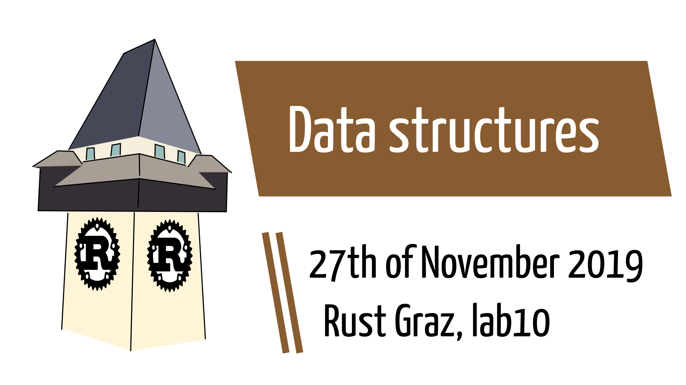
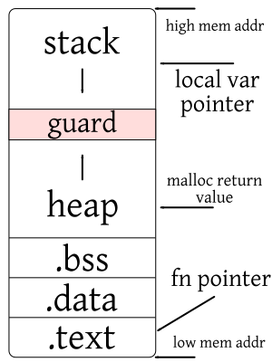
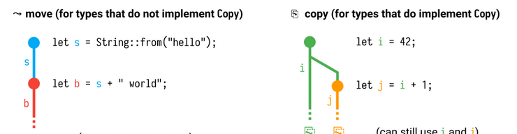

# Prologue

---

## Clarification 1: size of physical and virtual memory addresses

On 64-bit machines, we have 64-bit addresses for virtual and physical memory.

In the last years, Intel CPUs used 4-level paging and thus the lower 48 bits virtually to address bytes in memory.
Most recently, [Intel CPU Ice Lake (Aug 2019) uses 5-level paging](https://en.wikipedia.org/wiki/Intel_5-level_paging) and thus uses 57 bits effectively.

---

## Clarification 1: size of physical and virtual memory addresses

For example, [the Objective-C runtime on iOS 7 on ARM64, notably used on the iPhone 5S,](https://en.wikipedia.org/wiki/Tagged_pointer#Examples) uses *tagged pointers*.

48 bits ⇒ 256 TiB, 57 bits ⇒ 128 PiB

---

## Clarification 2: Stack &amp; heap collide. Why a segfault?

* Collision is called “Clashing”
* There is a guard page between stack and heap
* Access to the guard page triggers a segfault
* 64-bit address space is huge. You have plenty of space.

via [Qualys Security Advisory](https://www.openwall.com/lists/oss-security/2017/06/19/1) and [stackoverflow](https://stackoverflow.com/a/1335389)

---

## Clarification 2: Stack &amp; heap collide. Why a segfault?



---

## Clarification 2: Stack &amp; heap collide. Why a segfault?

```rust
fn count_calls(n: u64) -> u64 {
    if n < 1 {
        0
    } else {
        1 + count_calls(n - 1)
    }
}

fn main() {
    println!("{}", count_calls(174470))
}
```

<p class="fragment">Non-deterministic, but 174470 will crash in ~59/1000 cases.</p>

---

## Clarification 2: Stack &amp; heap collide. Why a segfault?

* Thinkpad T495s, AMD Ryzen 7 PRO 3700U, 16GB RAM
* 160 bytes per function call frame
* ⇒ 27,915,200 bytes (between 2<sup>24</sup> and 2<sup>25</sup>) allocated on stack before stackoverflow

<p class="fragment">160 bytes? That much? We debugged it. print and formatting is one reason (34 bytes).</p>
<p class="fragment">We compiled it optimized. Only a constant was left!</p>

---

## Clarification 2: Stack &amp; heap collide. Why a segfault?

```
thread 'main' has overflowed its stack
fatal runtime error: stack overflow
[1]    26166 abort      ./elf-executable
```

---

## Clarification 3: Allocate memory inside a for-loop

It is part of the function call stack frame, right?

```rust
fn main() {
    let a = 42;
    let b = 2;
    println!("{:p} {:p}", &a, &b);
    for i in 1..10 {
        let c = a + i * b;
        println!("{:p}", &c);
    }
}
```

---

## Clarification 3: Allocate memory inside a for-loop

```
0x7ffd4187ff20 0x7ffd4187ff24
0x7ffd4187ffb4
0x7ffd4187ffb4
0x7ffd4187ffb4
0x7ffd4187ffb4
0x7ffd4187ffb4
0x7ffd4187ffb4
0x7ffd4187ffb4
0x7ffd4187ffb4
0x7ffd4187ffb4
```

⇒ Yes

---

## Clarification 4: Dump the stack

→ [Inline assembly](https://doc.rust-lang.org/1.2.0/book/inline-assembly.html)

```rust
asm!(assembly template
   : output operands
   : input operands
   : clobbers
   : options
   );
```

* unstable API, only on nightly
* Only in `unsafe { }` blocks


---

## Clarification 4: Dump the stack

```rust
#![feature(asm)]

#[cfg(any(target_arch = "x86", target_arch = "x86_64"))]
fn dump_stack() {
    let nr_elements = 70;
    for i in 0..nr_elements {
        let offset = nr_elements - i - 1;
        let mut result: u64;
        unsafe {
            asm!("movq %rsp, %rax
                  addq %rbx, %rax
                  movq (%rax), %rcx"
                 : "={rcx}"(result)
                 : "{rbx}"(8 * offset)
                 : "rax", "rbx", "rcx"
                 :)
        }
        println!("sp+{:03} ⇒ value {:016x}",
                 8 * offset, result);
    }
}
```

---

## Clarification 4: Dump the stack

```rust
#[cfg(any(target_arch = "x86", target_arch = "x86_64"))]
#[inline(always)]
fn print_current_address() {
    let mut result: u64;
    unsafe {
        // https://stackoverflow.com/a/52050776
        asm!("leaq (%rip), %rax"
             : "={rax}"(result)
             :
             : "rax"
             :)
    }
    println!("rip = {:016x}", result);
}
```

---

## Clarification 4: Dump the stack

```rust
fn sub(sub_arg: u64) -> u64 {
    print_current_address();
    let sub_local = 0xDEAD_C0DE;
    let sub_sum = sub_arg + sub_local;
    dump_stack();
    sub_sum
}
fn main() {
    let _main_a: u64 = 0xDEAD_BEEF;
    let main_arg: u64 = 0xFEED_C0DE;
    print_current_address();
    let main_ret = sub(main_arg);
    assert_eq!(main_ret, 0x0000_0001_DD9B_81BC);
    let s = sub as *const ();
    let m = main as *const ();
    println!("sub = {:016p}", s);
    println!("main = {:016p}", m);
    print_current_address();
}
```

---

## Clarification 4: Dump the stack

```
rip = 00005639782d660f           early main instruction
rip = 00005639782d650a           early sub instruction
sp+552 ⇒ value 00000000feedc0de  main_arg local var
sp+544 ⇒ value 00000000deadbeef  _main_a local var
sp+536 ⇒ value 00005639782f8f18
sp+528 ⇒ value 0000000000000002
sp+520 ⇒ value 0000563979f16920
sp+512 ⇒ value 0000563979f16920
sp+504 ⇒ value 0000563979f16920
sp+496 ⇒ value 0000563979f16971
sp+488 ⇒ value 0000000000000000
sp+480 ⇒ value 0000000000000000
sp+472 ⇒ value 0000000000000000
sp+464 ⇒ value 0000000000000000
sp+456 ⇒ value 0000000000000000
sp+448 ⇒ value 0000000000000000
sp+440 ⇒ value 0000000000000000
sp+432 ⇒ value 0000000000000000
sp+424 ⇒ value 0000000000000000
sp+416 ⇒ value 0000000000000001
sp+408 ⇒ value 00005639782d66b5  return address(?)
sp+400 ⇒ value 00007fff62eef870
sp+392 ⇒ value 00007fff62eef870
sp+384 ⇒ value 00005639782f7600
sp+376 ⇒ value 00007fff62eef870
sp+368 ⇒ value 0000000000000001
sp+360 ⇒ value 00007fff62eef8a8
sp+352 ⇒ value 0000000000000001
sp+344 ⇒ value 00005639782f8f18
sp+336 ⇒ value 0000000000000002
sp+328 ⇒ value 0000563978503f48
sp+320 ⇒ value 00005639782d650a  early sub instruction(?!)
sp+312 ⇒ value 00000001dd9b81bc  sub_sum local var
sp+304 ⇒ value 00000000deadc0de  sub_local local var
sp+296 ⇒ value 00000000feedc0de  main_arg var
sp+288 ⇒ value 00005639782f8f18
sp+280 ⇒ value 00000001dd9b81bc  sub return value
sp+272 ⇒ value 0000000000000001
sp+264 ⇒ value 00005639782d65b8
sp+256 ⇒ value 00007fff62eefbf0
sp+248 ⇒ value 00007fff62eef7b0
sp+240 ⇒ value 00007fff62eef81c
sp+232 ⇒ value 000000f0782f9b25
sp+224 ⇒ value 00007fff62eef7b0
sp+216 ⇒ value 00007fff62eef81c
sp+208 ⇒ value 00005639782f7600
sp+200 ⇒ value 00007fff62eef7b0
sp+192 ⇒ value 00005639782f77b0
sp+184 ⇒ value 00007fff62eef81c
sp+176 ⇒ value 0000000000000002
sp+168 ⇒ value 00007fff62eef7e8
sp+160 ⇒ value 0000000000000002
sp+152 ⇒ value 00005639782f8e90
sp+144 ⇒ value 0000000000000003
sp+136 ⇒ value 0000563978503ef0
sp+128 ⇒ value 0000563978503ef0
sp+120 ⇒ value 0000000f00000036
sp+112 ⇒ value 0000003778503f48
sp+104 ⇒ value 0000003800000001
sp+096 ⇒ value 0000003979f16c03
sp+088 ⇒ value 000000460000003b
sp+080 ⇒ value 0000004600000000
sp+072 ⇒ value 0000004600000000
sp+064 ⇒ value 0000004600000009
sp+056 ⇒ value 0000000700000038
sp+048 ⇒ value 00000038e6568a80
sp+040 ⇒ value 00007fff62eef81c
sp+032 ⇒ value 00005639782f77b0
sp+024 ⇒ value 00007fff62eef7b0
sp+016 ⇒ value 00005639782f7600
sp+008 ⇒ value 00005639782f8e90
sp+000 ⇒ value 0000000000000002
sub = 0x005639782d64f0
main = 0x005639782d65e0
rip = 00005639782d69d7           late main instruction
```

# Dialogue

---

## Today

* Attributes and Feature guards
* Just for fun
* Recap → Quiz
* A tiny I/O example
* Stack
* Stack with String
* On pointers and references
* Graph

---

## Attributes and Feature guards

An *attribute* is metadata applied to some module, crate or item. This metadata can be used to/for:

* conditional compilation of code
* set crate name, version and type (bin/lib)
* disable lints (warnings)
* enable compiler features (macros,etc.)
* link to a foreign library
* mark functions as unit tests
* mark functions that will be part of a benchmark

---

## Attributes and Feature guards

```rust
// syntaxes
#[attribute = "value"]
#[attribute(key = "value")]
#[attribute(value)]
// multi-value attributes
#[attribute(value, value2)]
#[attribute(value, value2, value3,
            value4, value5)]
```

via [rust by example](https://doc.rust-lang.org/rust-by-example/attribute.html)

---

## Attributes and Feature guards

```rust
// ! means “scope is global = crate”
#![crate_type = "lib"]
// no ! means “scope is local = module/item”
#[allow(dead_code)]
```

---

## Attributes and Feature guards

Examples:

```rust
#![crate_type = "lib"]  // crate is library, not binary
#![crate_name = "rary"] // named “rary”

#[cfg(any(target_arch = "x86", target_arch = "x86_64"))]
#[inline(always)]
fn arch_specific_code() {}

#[allow(dead_code)]
fn unused_function() {}
```

---

## Attributes and [Feature guards](https://doc.rust-lang.org/unstable-book/language-features/box-syntax.html):

```rust
#![feature(box_syntax)]

#[allow(unused_variables)]
fn main() {
    let b = box 5;
}
```

… on unstable, instead of …

```rust
#[allow(unused_variables)]
fn main() {
    let b = Box::new(5);
}
```

---

## Just for fun


---

## Just for fun

Does it compile?

```C
#include <stdio.h>
int main() {
  printf("Hello %s!\n",
    #include "/dev/stdin"
  );
  return 0;
}
```

---

## Just for fun

```
meisterluk@gardner ~ % cat input
"RustGraz"
meisterluk@gardner ~ % cat input | gcc test.c
meisterluk@gardner ~ % ./a.out 
Hello RustGraz!
```

Yes on gcc, no on clang. via [Poita_ on twitter](https://twitter.com/Poita_/status/1198413809670598662)

---

## Recap (last session)

* `&a` is a (shared) reference. `&mut a` is a mutable reference.
* `*a` dereferences a variable (sometimes auto-dereferencing happens)
* Every variable has an owner. Owner can borrow ownership.
* Only owners can destroy the variable.
* References borrow ownership, they don't move ownership.

The ultimate rule: __aliasing XOR mutation__

---

## Quiz

```rust
fn sub(s: &mut String) {
    s.push('o');
}

fn main() {
    let mut base = String::from("f");
    sub(&mut base);
    sub(&mut base);
    println!("{} bar", base);
}
```

Compiles? <span class="fragment">Yes.</span>

---

## Quiz

```rust
fn sub(s: &mut String) {
    s.push('o');
}

fn main() {
    let mut base = String::from("f");
    let c = &mut base;
    sub(c);
    let d = &mut base;
    sub(d);
    println!("{} bar", base);
}
```

Compiles? <span class="fragment">Yes.</span>

---

## Quiz

```rust
fn sub(s: &mut String) {
    s.push('o');
}

fn main() {
    let mut base = String::from("f");
    let c = &mut base;
    let d = &mut base;
    sub(c);
    sub(d);
    println!("{} bar", base);
}
```

Compiles? <span class="fragment">No. “cannot borrow base as mutable more than once at a time”.</span>

---

## Quiz

Remark: [Sometimes](https://www.jawahar.tech/home/no-more-dangling-pointers-with-rust) borrowing is explained with “not more than one mutable reference allowed in a scope”. It is a little bit more complicated IMHO. [Aaron Turon](https://www.youtube.com/watch?v=hY0gyzItyEo&t=49m16s) explains it with overlapping regions.

An approach to visualization: [rufflewind.com](https://rufflewind.com/2017-02-15/rust-move-copy-borrow)



---

## A tiny I/O example

---

### A tiny I/O example

[std::io::Stdin](https://doc.rust-lang.org/std/io/struct.Stdin.html)

* `pub fn lock(&self) -> StdinLock`: Locks this handle to the standard input stream, returning a readable guard.
* `pub fn read_line(&self, buf: &mut String)` `-> Result<usize>`: Locks this handle and reads a line of input into the specified buffer.

`StdinLock` implements the `Read` and `BufRead` traits ⇒ useful methods.

---

### A tiny I/O example

```rust
use std::io::{self, Write};

fn read_line() -> String {
    let mut input = String::new();
    match io::stdin().read_line(&mut input) {
        Ok(n) => {
            eprintln!("{} bytes, {:?}, {:?}", n,
                      input.into_bytes(), input);
            input
        }
        Err(error) => panic!(error),
    }
}
```

<p class="fragment">Does this code compile?</p>

---

### A tiny I/O example

```
error[E0382]: borrow of moved value: `input`
 --> src/main.rs:7:70
  |
4 | let mut input = String::new();
  |     --------- move occurs because `input` has type
  |     `std::string::String`, which does not implement
  |     the `Copy` trait
...
7 | eprintln!("{} bytes, {:?}, {:?}", n,
  |           input.into_bytes(), input);
  |           -----               ^^^^^
  |             |                 value moved here
  |           value borrowed here after move
```

---

### A tiny I/O example

`pub fn into_bytes(self) -> Vec<u8>`: Converts a String into a byte vector. This consumes the String, so we do not need to copy its contents.

```rust
let n = 42;
let mut input = String::new();
eprintln!("{} bytes, {:?}, {:?}", n,
  String::from(input).into_bytes(), input);
```

Does this code compile? <span class="fragment">No, still consuming.</span>

---

### A tiny I/O example

```rust
let n = 42;
let mut input = String::new();
eprintln!("{} bytes, {:?}, {:?}", n,
    String::from(&input).into_bytes(), input);
```

It compiles!

---

### A tiny I/O example

```rust
fn main() {
    loop {
        print!("⇐ ");
        io::stdout().flush().unwrap();
        let line = read_line();
        if line == "" || line == "0\n" {
            break
        }
        println!("⇒ {}", line)
    }
}
```

⇒ We use it to fetch dynamic data.

---

## Data structure: Stack

---

### Data structure: Stack

* Do you remember stack and heap from last session?
* PUSH and POP operation
* PUSH: add element to the top
* POP: remove element from the top and return it
* `O(1)` time complexity for both operations

---

### Data structure: Stack

```rust
#[derive(Debug)]
struct Stack {
    content: Vec<u64>
}

impl Stack {
    fn new() -> Stack {
        Stack { content: Vec::<u64>::new() }
    }

    fn push(&mut self, element: u64) -> &mut Self {
        self.content.push(element);
        self
    }

    fn pop(&mut self) -> Option<u64> {
        self.content.pop()
    }
}
```

---

### Data structure: Stack

```rust
use std::fmt;
use std::io::{self, Write};

impl fmt::Display for Stack {
    fn fmt(&self, f: &mut fmt::Formatter<'_>)
    -> fmt::Result {
        write!(f, "Stack[{}]", self.content
          .iter().map(|uint| { uint.to_string() })
          .collect::<Vec<String>>().join(" "))
    }
}
```

---

### Data structure: Stack

```rust
// Example usage
fn main() {
    let s = Stack::new();
    s.push(1).push(1).push(2).push(3).push(5).push(8);
    println!("{}", s.pop());
}
```

Does it compile? <span class="fragment">No.</span>

---

### Data structure: Stack

```rust
// Example usage
fn main() {
    let mut s = Stack::new();
    s.push(1).push(1).push(2).push(3).push(5).push(8);
    println!("{}", s.pop());
}
```

`s` is now mutable. Does it compile? <span class="fragment">No.</span>

---

### Data structure: Stack

```rust
// Example usage
fn main() {
    let mut s = Stack::new();
    s.push(1).push(1).push(2).push(3).push(5).push(8);
    println!("{}", s.pop().unwrap());
}
```

`pop()` returns `std::option::Option<u64>`.
<div class="fragment">It compiles.</div>

---

### Data structure: Stack

```rust
// Parse a line and push integer to the stack
fn handle_input(s: &mut Stack, input: &String) {
    let mut provided_integer = 0;
    let mut valid = true;
    let input_trimmed = input.trim();
    match input_trimmed.parse::<u64>() {
        Ok(val) => provided_integer = val,
        Err(_) => {
            println!("… is not an integer");
            valid = false;
        },
    }
    if valid {
        s.push(provided_integer);
    }
}
```

---

### Data structure: Stack

More advanced:

```rust
#[derive(PartialEq)]
enum Op {
  Pop,
  Push,
  Print,
}

…
match op {
  Op::Push => { s.push(provided_integer); },
  Op::Pop => { println!("{:?}", s.pop()); },
  Op::Print => { println!("{}", s); },
}
```

---

### Data structure: Stack

```rust
fn handle_input(s: &mut Stack, input: &String) {
  let input_trimmed = input.trim();
  let mut fields = input_trimmed.split_whitespace();

  let op = match fields.next() {
    Some("push") => Op::Push,
    Some("pop") => Op::Pop,
    Some("print") => Op::Print,
    Some(_) | None => {
      eprintln!("unknown operation");
      return;
    },
  };
  …
```

---

### Data structure: Stack

```rust
    …
    let mut provided_integer = 0;
    if op == Op::Push {
        match fields.next() {
            Some(val) => {
                match val.parse::<u64>() {
                    Ok(val) => provided_integer = val,
                    Err(_) => {
                        eprintln!("… is not an integer");
                        return;
                    },
                }
            },
            None => {
                eprintln!("I find this lack of arguments disturbing!");
                return;
            }
        }
    }
```

---

### Data structure: Stack

```rust
    …
    match op {
        Op::Push => { s.push(provided_integer) },
        Op::Pop => { println!("{:?}", s.pop()) },
        Op::Print => { println!("{}", s) },
    }
}
```

Does it compile? <span class="fragment">No, unmatching types in branches</span>

---

### Data structure: Stack

```rust
    …
    match op {
        Op::Push => { s.push(provided_integer); },
        Op::Pop => { println!("{:?}", s.pop()); },
        Op::Print => { println!("{}", s); },
    }
}
```

Does it compile? Yes, with semicolons.

---

### Data structure: Stack

```rust
    …
    match op {
        Op::Push => { s.push(provided_integer); },
        Op::Pop => { println!("{:?}", s.pop()); },
        Op::Print => { println!("{}", s); },
    }
}
```

---

### Data structure: Stack

```rust
fn main() {
    let mut s = Stack::new();
    loop {
        print!("⇐ ");
        io::stdout().flush().unwrap();
        let line = read_line();
        if line == "" || line == "bye\n" {
            break
        }
        handle_input(&mut s, &line);
        println!("⇒ {}", line)
    }
    println!("{}", s);
}
```

---

### Data structure: Stack

```rust
% cargo run
⇐ push 42
⇒ push 42

⇐ push 73
⇒ push 73

⇐ print
Stack[42 73]
⇒ print

⇐ pop
Some(73)
⇒ pop

⇐ Stack[42]
```

---

## Data structure: Stack with strings

---

### Data structure: Stack with strings

Use `String` instead of `u64` as elements.
What is the interesting difference?

→ Replace every occurence of `u64` with `String`.

Does it compile? <p class="fragment">Yes.</p>

---

## On pointers and references

Pointers in C/C++:

{NULL Pointer, Dangling Pointer, Generic Pointer, Wild Pointer, Near Pointer, Far Pointer, Huge Pointer, Fat pointer, Shared pointer, Smart pointer, Unique pointer, Weak pointer}

---

## On pointers and references

**NULL pointer**

* defined e.g. in `stddef.h`
* Tony Hoare “I call it my billion-dollar mistake. It was the invention of the null reference in 1965”
* Use Option/Result instead in rust

---

## On pointers and references

**Dangling Pointer**

* object A exists
* pointer p points to A
* object A vanishes
* pointer p becomes a Dangling pointer
* Impossible in rust to the best of my knowledge

---

## On pointers and references

**Generic Pointer**

* aka “void pointer”
* [std::ptr::null_mut](https://doc.rust-lang.org/nightly/std/ptr/fn.null_mut.html)
* rust has a strong, full-featured type system
* thus only used for FFI in rust

---

## On pointers and references

**Wild pointer**

* i.e. uninitialized pointer
* `int *ptr;` in C
* `let a: Box<u32>; a = Box::new(5);` in rust
* rust ensure: no read before write!

---

## On pointers and references

**Near Pointer**

* can only address values in (e.g.) ±32KB data segment

**Far Pointer**

* can address values outside (e.g.) ±32KB data segment

Non-standard Intel extension (16 bit architecture).

---

## On pointers and references

**Huge Pointer**

Like far pointer, but points to consecutive memory blocks (→ memory management details)

---

## On pointers and references

**Fat Pointer**

```
size_of::<&u32>() = 8
size_of::<&[u32; 2]>() = 8
size_of::<&[u32]>() = 16
```

`&[u32]` must carry around the length of the memory view.
Thus needs more space.

via [stackoverflow](https://stackoverflow.com/q/57754901)

---

## On pointers and references

**Shared pointer**

> Manages the storage of a pointer, providing a limited garbage-collection facility, possibly sharing that management with other objects.

via C++: [shared_ptr](http://www.cplusplus.com/reference/memory/shared_ptr/)

---

## On pointers and references

**Smart pointer**

> A smart pointer is an abstract data type that simulates a pointer while providing added features, such as automatic memory management or bounds checking

via [Wikipedia](https://en.wikipedia.org/wiki/Smart_pointer)

---

## On pointers and references

**Unique pointer**

> `std::unique_ptr` is a smart pointer that owns and manages another object through a pointer and disposes of that object when the unique_ptr goes out of scope. 

via C++: [unique_ptr](https://en.cppreference.com/w/cpp/memory/unique_ptr)

---

## On pointers and references

**Weak pointer**

> `std::weak_ptr` is a smart pointer that holds a non-owning ("weak") reference to an object that is managed by std::shared_ptr. It must be converted to std::shared_ptr in order to access the referenced object. 

via C++: [weak_ptr](https://en.cppreference.com/w/cpp/memory/weak_ptr)

---

## std::rc::Rc

* A single-threaded reference-counting pointer. 'Rc' stands for 'Reference Counted'.
* The type `Rc<T>` provides shared ownership of a value of type `T`, allocated in the heap. Invoking `clone` on Rc produces a new pointer to the same value in the heap. When the last Rc pointer to a given value is destroyed, the pointed-to value is also destroyed.

via [rust doc](https://doc.rust-lang.org/std/rc/index.html)

---

## Data structure: Graph

* A graph consists of vertices and edges
* Vertices are distinctive and edges are tuples (directed) or sets (undirected) of 2 edges
* e.g. DAG – Directed Acyclic Graph
* See code example

---

### valgrind to check for memory leaks

```
% valgrind ./target/debug/strstack
==4731== Memcheck, a memory error detector
==4731== Copyright (C) 2002-2017, and GNU GPL'd, by Julian Seward et al.
==4731== Using Valgrind-3.14.0 and LibVEX; rerun with -h for copyright info
==4731== Command: ./target/debug/stack
==4731== 
⇐ push foo
⇒ push foo

⇐ push bar
⇒ push bar

⇐ push baz
⇒ push baz

⇐ pop
Some("baz")
⇒ pop

⇐ Stack[foo bar]
0x1ffefff4a4 0x1ffefff4a8
==4731== 
==4731== HEAP SUMMARY:
==4731==     in use at exit: 0 bytes in 0 blocks
==4731==   total heap usage: 39 allocs, 39 frees, 12,030 bytes allocated
==4731== 
==4731== All heap blocks were freed -- no leaks are possible
==4731== 
==4731== For counts of detected and suppressed errors, rerun with: -v
==4731== ERROR SUMMARY: 0 errors from 0 contexts (suppressed: 0 from 0)
```

# Epilogue

---

## Quiz

<dl>
<dt>How can we print a pointer with fmt?</dt>
<dd class="fragment"><code>{:p}</code></dd>
<dt>What is rust's ultimate borrowing rule?</dt>
<dd class="fragment">aliasing XOR mutation</dd>
<dt>Which print macro prints to stderr?</dt>
<dd class="fragment">e-prefixed `eprintln!(…)`</dd>
<dt>How can we parse a string into an integer?</dt>
<dd class="fragment"><code>stringvar.parse::&lt;u64&gt;()</code></dd>
<dt>Why was <code>#[derive(PartialEq)]</code> required?</dt>
<dd class="fragment"><code>op == Op::Push</code> requires it, not <code>match</code></dd>
</dl>

---

## Next session

Wed, 2019/12/25 19:00? <br/>
→ 2019/12/18 instead

My suggestion:

1. **Short topic:** Strings, string types and UTF-8
2. **Fun:** Hacker jeopardy

January: Traits, generics <br/>
Feb+: lifetimes, concurrency, macros, crates, crates, crates …

